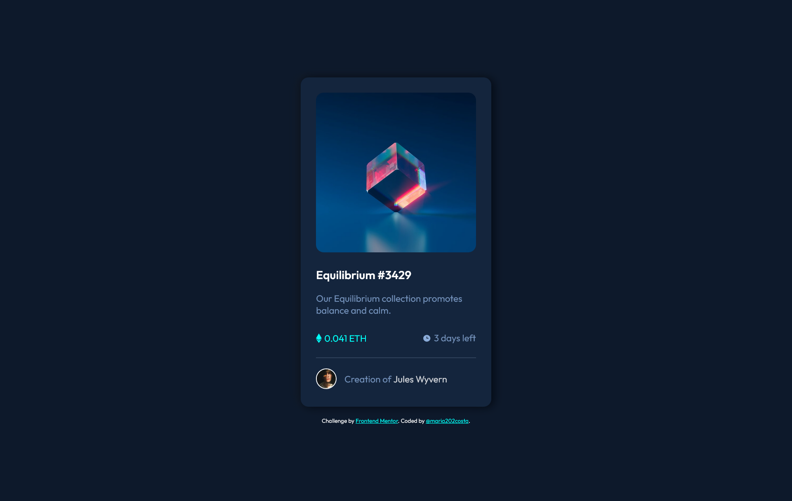

# Frontend Mentor - NFT preview card component solution

This is a solution to the [NFT preview card component challenge on Frontend Mentor](https://www.frontendmentor.io/challenges/nft-preview-card-component-SbdUL_w0U). Frontend Mentor challenges help you improve your coding skills by building realistic projects.

## Table of contents

- [Overview](#overview)
- [The challenge](#the-challenge)
- [Screenshot](#screenshot)
- [Links](#links)
- [My process](#my-process)
- [Built with](#built-with)
- [What I learned](#what-i-learned)
- [Useful resources](#useful-resources)
- [Author](#author)

## Overview

This challenge is a NFT card component, made using only HTML and CSS, with active/hover states in the image, card title and author name.

### The challenge

Users should be able to:

- View the optimal layout depending on their device's screen size
- See hover states for interactive elements

### Screenshot

### Links

- Solution URL: [Solution URL](https://www.frontendmentor.io/solutions/a-responsive-nft-main-component-using-html-and-css-js0XS-tMZC)
- Live Site URL: [Live Site URL](https://nft-main-component.vercel.app/)

## My process

Beginning with the HTML document, i used the BEM(Block, Element and Modifier) metodology for the organization of the markup tags, using the semantic HTML, with the best tags for the necessary style. The block was the `<main>` tag, following the class name "main..." for the elements within the main block, and the only modifier used was in the author name, with the "--emphasis" modifier. The CSS was made following the HTML doc with BEM. Finishing with the media queries for the sizes that was need to update.

### Built with

- Semantic HTML5 markup
- CSS custom properties
- Flexbox
- BEM CSS metodology

### What I learned

How to use the BEM methodology for a best organized CSS document, separating the elements in respective divisions according to their functions, and naming the classes in the main block;

### Useful resources

The site were i get the box shadow, take a look!
[Beautiful CSS box-shadow examples](https://getcssscan.com/css-box-shadow-examples);

## Author

- Frontend Mentor - [@maria202costa](https://www.frontendmentor.io/profile/maria202costa)
